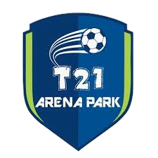

  

Aplicação desenvolvida para o controle de uma escola de futebol para alunos com síndrome de Down.

  <a href="#-sobre-o-projeto">Sobre o projeto</a>&nbsp;&nbsp;&nbsp;|&nbsp;&nbsp;&nbsp;
  <a href="#-repositórios">Repositórios</a>&nbsp;&nbsp;&nbsp;|&nbsp;&nbsp;&nbsp;
  <a href="#-licença">Licença</a>

## 💻 Sobre o Projeto

O **T21 Arena Park** é um software desenvolvido para promover a inclusão e o acompanhamento de crianças com síndrome de Down por meio de atividades esportivas, com foco no futsal. O projeto visa criar um ambiente acessível para gerenciar organizações, voluntários e atletas, além de monitorar o progresso dos atletas por meio de avaliações estruturadas, como anamneses.

O sistema foi projetado com o objetivo de auxiliar organizações na gestão de suas atividades e melhorar a qualidade do acompanhamento dos atletas. Com uma interface intuitiva e funcionalidades bem estruturadas, o **T21 Arena Park** busca contribuir para a inclusão social e a conscientização por meio do esporte.

## :octocat: Repositórios

Você pode acessar as pastas `api` e `web` para explorar algumas das funcionalidades do aplicativo. Cada pasta contém os arquivos e códigos necessários para algumas funcionalidades do sistema.

- [api](./api/README.md)
- [web](./web/README.md)

## 📝 Licença

Este projeto está sob a licença MIT. Consulte o arquivo `LICENSE` para mais detalhes.
